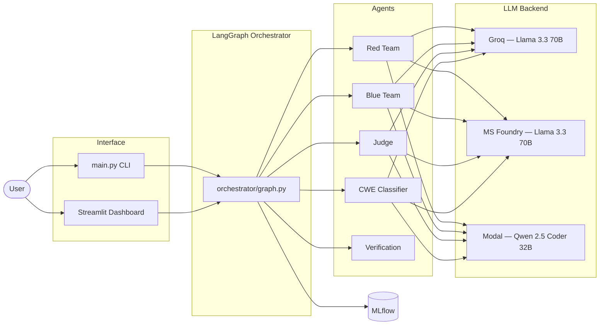
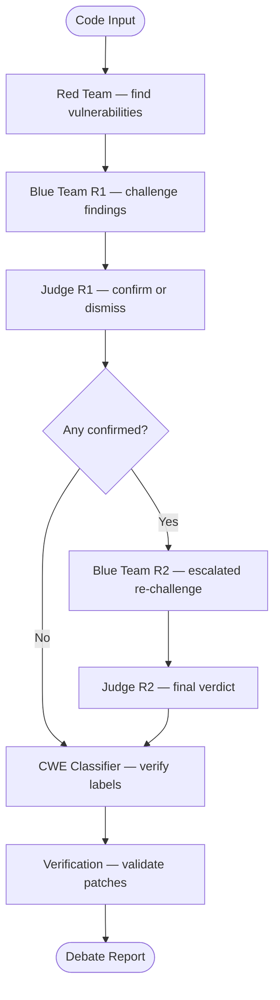

# LLM Code Security Scanner

[](https://github.com/Avalee21/llm-code-security-scanner/actions/workflows/ci.yml)
[](https://llm-code-security-scanner.streamlit.app/)

A multi-agent system that performs automated code security review using an adversarial debate pattern. It can scan individual source files **or GitHub pull requests / commits**, focusing only on changed lines to catch vulnerabilities introduced by new code.

Three LLM-powered agents collaborate to identify vulnerabilities:

- **Red Team** — scans code for potential security vulnerabilities, requiring concrete exploit paths
- **Blue Team** — critically evaluates Red Team findings and filters out false positives
- **Judge** — delivers a reasoned final verdict on each finding by weighing both sides against the source code

The pipeline is orchestrated with [LangGraph](https://github.com/langchain-ai/langgraph) and experiment tracking is handled by [MLflow](https://mlflow.org/).

## Architecture



### System Overview



### Adversarial Debate Pipeline



Only findings that survive the full adversarial debate (both rounds) are confirmed. Round 2 verdicts override Round 1 when present.

## Setup

### Option A: Docker (recommended)

```bash
git clone git@github.com:Avalee21/llm-code-security-scanner.git
cd llm-code-security-scanner
cp .env.example .env   # edit .env with your API keys
docker compose up --build
```

- Streamlit dashboard: http://localhost:8501
- MLflow UI: http://localhost:5000

### Option B: Local install

```bash
git clone git@github.com:Avalee21/llm-code-security-scanner.git
cd llm-code-security-scanner
pip install -r requirements.txt        # runtime deps (pinned)
pip install -r requirements-dev.txt    # adds pytest for development
```

### Configure environment variables

Copy the example env file and fill in your API key:

```bash
cp .env.example .env
```

Edit `.env` and set:

| Variable              | Description                                    |
| --------------------- | ---------------------------------------------- |
| `GROQ_API_KEY`        | Your [Groq](https://console.groq.com/) API key |
| `LLM_BACKEND`         | `groq` (default), `foundry`, or `modal`        |
| `FOUNDRY_ENDPOINT_URL`| Microsoft Foundry endpoint (if `LLM_BACKEND=foundry`) |
| `FOUNDRY_API_KEY`     | Microsoft Foundry API key (if `LLM_BACKEND=foundry`) |
| `MODAL_ENDPOINT_URL`  | Modal vLLM endpoint (if `LLM_BACKEND=modal`) |
| `MLFLOW_TRACKING_URI` | MLflow store path (default `./mlruns`)         |
| `GITHUB_TOKEN`        | GitHub token (optional — for private repos / higher rate limits) |

## Usage

### Scan a source file

```bash
python main.py --file path/to/code.c
```

### Scan a GitHub pull request or commit

Point the scanner at any GitHub PR or commit URL — it fetches the diff, extracts only the changed code with surrounding context, and runs the adversarial debate on each modified file:

```bash
# Scan a pull request
python main.py --pr https://github.com/Avalee21/vulnerable-code-demo/pull/1

# Scan a specific commit
python main.py --commit https://github.com/Avalee21/vulnerable-code-demo/commit/875bcbbf97463462cf8feb3fef1b8ee34785c7e1
```

For private repositories, provide a GitHub token:

```bash
python main.py --pr https://github.com/owner/private-repo/pull/42 --github-token ghp_xxx
# Or set GITHUB_TOKEN in your .env
```

The scanner automatically:
- Filters to source code files only (skips `.md`, `.json`, images, etc.)
- Extracts changed hunks with ~15 lines of surrounding context (not the full file) to save tokens
- Skips files with >500 changed lines
- Runs the full Red → Blue → Judge debate per file

### Scan a golden set sample

List all available samples:

```bash
python main.py --list-golden
```

Scan by index or ID:

```bash
python main.py --golden 0
python main.py --golden CASTLE-CWE-22-1
```

### Demo individual agents

Run only the Red Team (attack) stage:

```bash
python main.py --golden 0 --red-only
```

Run Red + Blue Team (attack and defense) without the Judge:

```bash
python main.py --file code.c --blue-only
```

These modes skip the Judge, MLflow logging, and evaluation — useful for demos and debugging.

### Disable MLflow tracking

Append `--no-mlflow` to any scan command:

```bash
python main.py --file code.c --no-mlflow
```

## Web Dashboard

Launch the interactive Streamlit dashboard:

```bash
streamlit run app.py
```

Open http://localhost:8502 in your browser. The dashboard provides three modes:

- **Paste Code** — paste any source code and scan it
- **GitHub PR / Commit** — enter a GitHub URL to scan only the changed lines
- **Golden Set** — pick a sample from the curated test set and compare results against ground truth

Each scan shows the full adversarial debate: Red Team findings, Blue Team defenses, and Judge verdicts with expandable reasoning.

## Batch Evaluation

Run the full debate pipeline on golden set samples and log aggregate metrics to MLflow:

```bash
python -m scripts.eval_golden_set                # all 30 samples
python -m scripts.eval_golden_set --limit 10      # first 10 samples
```

Run the Red-Team-Only baseline (same Red Team prompt, all findings auto-confirmed, no debate) for comparison:

```bash
python -m scripts.eval_baseline --limit 10
```

Both scripts print a per-sample table, overall precision/recall/F1, CWE-matched metrics, and a per-CWE breakdown, then log everything to MLflow.

### Golden Set

The evaluation uses a curated set of **30 C samples** drawn from the [CASTLE-C250](https://github.com/) dataset:

- **6 CWE categories** × 5 samples each: CWE-22 (Path Traversal), CWE-78 (OS Command Injection), CWE-89 (SQL Injection), CWE-190 (Integer Overflow), CWE-476 (NULL Pointer Dereference), CWE-798 (Hard-coded Credentials)
- Each sample has a ground-truth label (`vulnerable` or `safe`) and expected CWE type
- The golden set is version-controlled in `data/golden_set.json`

### Evaluation Methodology

The primary evaluation uses **binary detection classification**: a sample is counted as a True Positive when the system confirms **any** vulnerability finding, regardless of CWE type. CWE-matched metrics are computed as a secondary measure.

#### Why binary detection as primary?

The debate pipeline's core contribution is adversarial false-positive filtering (Blue Team + Judge), not CWE classification. Using binary metrics isolates this contribution cleanly. CWE accuracy is a separate sub-task handled by the CWE Classifier agent — mixing it into the primary metric would penalise the debate pipeline for classifier errors unrelated to the debate's quality.

#### Baseline: Red Team Only

The baseline uses the **exact same Red Team prompt** as the debate pipeline, but auto-confirms all findings without any adversarial challenge. This creates a fair apples-to-apples comparison:

| | Red Team Only (baseline) | Debate Pipeline |
|---|---|---|
| Detection | Red Team prompt | Same Red Team prompt |
| Filtering | None — all auto-confirmed | Blue Team + Judge + Round 2 |
| Measured difference | — | Exactly the value added by the adversarial debate |

#### Per-sample classification (primary — binary detection)

Each golden set sample has a ground-truth label (`vulnerable` or `safe`).

| Ground Truth | System Result | Classification |
|---|---|---|
| Vulnerable | Any finding confirmed | **TP** (True Positive) |
| Vulnerable | No finding confirmed | **FN** (False Negative) |
| Safe | Any finding confirmed | **FP** (False Positive) |
| Safe | No finding confirmed | **TN** (True Negative) |

#### Per-sample classification (secondary — CWE-matched)

A stricter view where a vulnerable sample is only TP when a confirmed finding carries the **correct CWE type**:

| Ground Truth | System Result | Classification |
|---|---|---|
| Vulnerable | Confirmed finding with correct CWE | **TP** |
| Vulnerable | Confirmed finding with wrong CWE | **FN** — detected something, but wrong type |
| Vulnerable | No finding confirmed | **FN** — missed entirely |
| Safe | Any finding confirmed | **FP** — regardless of CWE |
| Safe | No finding confirmed | **TN** |

#### Aggregate metrics

From the per-sample TP/FP/TN/FN counts:

| Metric | Formula | What it measures |
|---|---|---|
| **Precision** | TP / (TP + FP) | Of flagged samples, how many were actually vulnerable with the correct CWE |
| **Recall** | TP / (TP + FN) | Of vulnerable samples, how many were correctly identified with the right CWE |
| **F1** | 2 × Precision × Recall / (Precision + Recall) | Harmonic mean — balances precision and recall |
| **FPR** | FP / (FP + TN) | Of safe samples, how many were incorrectly flagged |

#### Per-CWE breakdown

The same TP/FP/TN/FN + F1 metrics are also computed per CWE category (e.g. CWE-22, CWE-78, CWE-798) to identify which vulnerability types the system handles well and which it struggles with.

#### What "confirmed" means

A finding is "confirmed" when it survives the full adversarial debate:
1. Red Team proposes it
2. Blue Team challenges it (Round 1, optionally Round 2)
3. Judge delivers a final verdict

Only findings the Judge confirms in the final round count. If Round 2 happened for a finding, the Round 2 verdict overrides Round 1.

## Deployment

### Docker Compose (recommended)

```bash
docker compose up --build
```

This starts three services:

| Service | URL | Description |
|---|---|---|
| `app` | http://localhost:8501 | Streamlit dashboard |
| `mlflow` | (internal) | MLflow tracking server |
| `mlflow-proxy` | http://localhost:5000 | Nginx reverse proxy for MLflow UI |

Both services share an `mlruns` volume so experiment data is visible in both. API keys are read from `.env` (never baked into the image).

### Docker image from GHCR

Pre-built images are published on every tagged release:

```bash
docker pull ghcr.io/avalee21/llm-code-security-scanner:latest
docker run --env-file .env -p 8501:8501 ghcr.io/avalee21/llm-code-security-scanner:latest
```

### Manual deployment

```bash
pip install -r requirements.txt
streamlit run app.py                # dashboard on port 8501
mlflow ui                           # MLflow on port 5000 (separate terminal)
```

### Production considerations

- Place a reverse proxy (Nginx / Caddy) in front for HTTPS termination
- Store API keys in a secrets manager, not `.env` files
- The MLflow UI has no built-in authentication — add basic auth via your proxy if exposed publicly

### AWS EC2 (CloudFormation)

Deploy the full stack (Streamlit + MLflow) to EC2 with one click using the included CloudFormation template.

#### Step-by-step: Create the stack via AWS Console

1. Open the **AWS Management Console** and search for **CloudFormation**
2. Click **Create stack** → **With new resources (standard)**
3. Under **Specify template**, choose **Upload a template file**
4. Click **Choose file** and select `infra/cloudformation.yml` from your local machine
5. Click **Next**
6. Fill in the **Stack name** (e.g., `llm-security-scanner`) and parameters:
   - **GroqApiKey** — your Groq API key (masked input, stored securely)
   - **KeyName** — select an existing EC2 key pair (e.g., `vockey` for AWS Academy)
   - **InstanceType** — `t2.small` recommended (default)
   - **GitHubRepo** — leave default unless using a fork
7. Click **Next** → **Next** (skip tags/options)
8. On the review page, check **I acknowledge that AWS CloudFormation might create IAM resources** if prompted
9. Click **Submit** and wait for status to reach `CREATE_COMPLETE` (~3 min)
10. Go to the **Outputs** tab to find your URLs and SSH command

| Output | Example |
|---|---|
| StreamlitURL | `http://<public-ip>:8501` |
| MLflowURL | `http://<public-ip>:5000` |
| SSHCommand | `ssh -i <keyname>.pem ec2-user@<public-ip>` |

#### SSH access

The Docker build takes a few minutes after the stack is created. To check progress via SSH:

```bash
# Replace <path-to-key> with the location of your downloaded .pem file
# Replace <public-ip> with the IP from the Outputs tab
ssh -i <path-to-key>/labsuser.pem ec2-user@<public-ip>
```

> **First-time Windows users:** If you get a "permissions too open" error, fix it in PowerShell:
> ```powershell
> icacls "<path-to-key>\labsuser.pem" /inheritance:r
> icacls "<path-to-key>\labsuser.pem" /remove "NT AUTHORITY\Authenticated Users"
> icacls "<path-to-key>\labsuser.pem" /grant:r "${env:USERNAME}:(R)"
> ```

Once connected, verify the deployment:

```bash
cd /home/ec2-user/app
sudo docker compose ps        # check container status
sudo docker compose logs -f   # follow build/startup logs
```

The template automatically installs Docker, clones the repo, configures `.env`, and runs `docker compose up`.

> **Important:** The GitHub repo must be **public** for the automated clone to work. If private, the UserData script will fail on `git clone`.

> **AWS Academy note:** Learner Lab sessions time out after ~4 hours. The instance stops when the session ends — restart it from the EC2 console next session (the public IP may change). The SSH key file is `labsuser.pem`, downloadable from the **AWS Details** panel in Learner Lab.

### Streamlit Community Cloud (free live demo)

You can deploy a live instance for free on [Streamlit Community Cloud](https://streamlit.io/cloud):

1. Fork or push this repo to your GitHub account
2. Go to [share.streamlit.io](https://share.streamlit.io) and sign in with GitHub
3. Click **New app** → select your repo → set **Main file path** to `app.py`
4. Under **Advanced settings → Secrets**, add your API keys:
   ```toml
   GROQ_API_KEY = "gsk_..."
   # Or for Foundry:
   # LLM_BACKEND = "foundry"
   # FOUNDRY_ENDPOINT_URL = "https://..."
   # FOUNDRY_API_KEY = "..."
   ```
5. Click **Deploy**

> **Note:** MLflow logging is automatically disabled on Streamlit Cloud (ephemeral filesystem). All scanning features work normally.

## Reproducibility Guide

All dependencies are pinned to exact versions in `requirements.txt`. To reproduce evaluation results:

```bash
# 1. Clone and set up
git clone git@github.com:Avalee21/llm-code-security-scanner.git
cd llm-code-security-scanner
pip install -r requirements.txt
cp .env.example .env               # configure your API key

# 2. Run the full debate pipeline evaluation
python -m scripts.eval_golden_set

# 3. Run the Red-Team-Only baseline for comparison
python -m scripts.eval_baseline

# 4. Compare results in MLflow
mlflow ui                          # open http://127.0.0.1:5000
```

**What ensures reproducibility:**

| Factor | Mechanism |
|---|---|
| Dependencies | Pinned in `requirements.txt` (exact versions) |
| Golden set | Version-controlled in `data/golden_set.json` |
| LLM temperature | Set to `0.0` by default for deterministic outputs |
| Experiment tracking | MLflow logs all params, metrics, and artifacts per run |
| Runtime environment | Docker ensures identical OS + Python + deps |

> **Note:** LLM outputs may vary slightly across runs even at temperature 0 due to provider-side non-determinism. Run multiple evaluations and compare aggregate metrics in MLflow for robust conclusions.

## Viewing Results in MLflow

Start the MLflow UI:

```bash
mlflow ui
```

Open http://127.0.0.1:5000 in your browser. Results are under the **code-security-scanner** experiment. Each run contains:

- **Params** — model name, backend, prompt version hashes, method (`debate-pipeline` or `red-team-only`)
- **Metrics** — precision, recall, F1, false positive rate, TP/FP/TN/FN counts (both binary and CWE-matched)
- **Artifacts** — `per_sample_results.json`, `per_cwe_results.json`

## Running Tests

```bash
pip install -r requirements-dev.txt   # installs pytest
pytest tests/ -v
```

Tests mock all LLM calls so no API key is needed.

## Project Structure

```
app.py                     Streamlit web dashboard
main.py                    CLI entry point
Dockerfile                 Container image for the Streamlit app
docker-compose.yml         Streamlit + MLflow service definitions
requirements.txt           Pinned runtime dependencies
requirements-dev.txt       Dev dependencies (pytest)
.env.example               Environment variable template
orchestrator/graph.py      LangGraph pipeline wiring + MLflow logging
agents/
  red_team.py              Red Team agent (LLM-powered)
  blue_team.py             Blue Team agent (LLM-powered)
  judge_patcher.py         Judge agent (LLM-powered)
  cwe_classifier.py        CWE classification agent
utils/
  llm.py                   Shared LLM factory (Groq / Foundry / Modal backends)
  schemas.py               Pydantic models (findings, defenses, verdicts, diff reports)
  metrics.py               Evaluation metrics (binary + CWE-matched)
  github.py                GitHub API integration (PR/commit diff fetching)
scripts/
  eval_golden_set.py       Debate pipeline evaluation
  eval_baseline.py         Red-Team-Only baseline evaluation
  select_golden_set.py     Script used to curate golden set from CASTLE-C250
  modal_server.py          vLLM server deployment on Modal
data/
  golden_set.json          30 curated C samples (6 CWEs × 5 each)
tests/                     Unit tests (pytest, all LLM calls mocked)
infra/
  cloudformation.yml       AWS CloudFormation template (EC2 deployment)
  nginx-mlflow.conf        Nginx reverse proxy config for MLflow
docs/
  llm_scanner_full_architecture.svg  Full architecture diagram
.streamlit/
  config.toml              Streamlit server configuration
.github/workflows/
  ci.yml                   CI pipeline (test on push/PR)
  release.yml              Docker build + push to GHCR on tagged release
```
